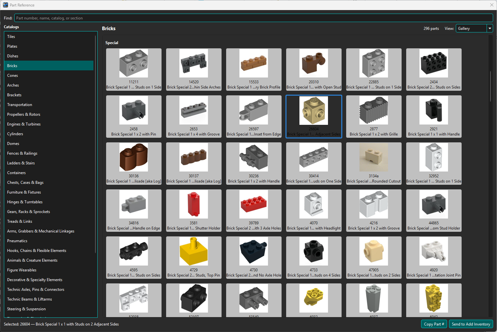
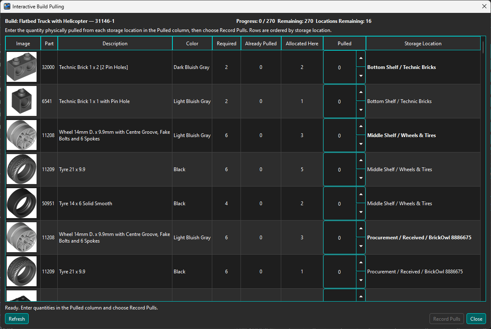
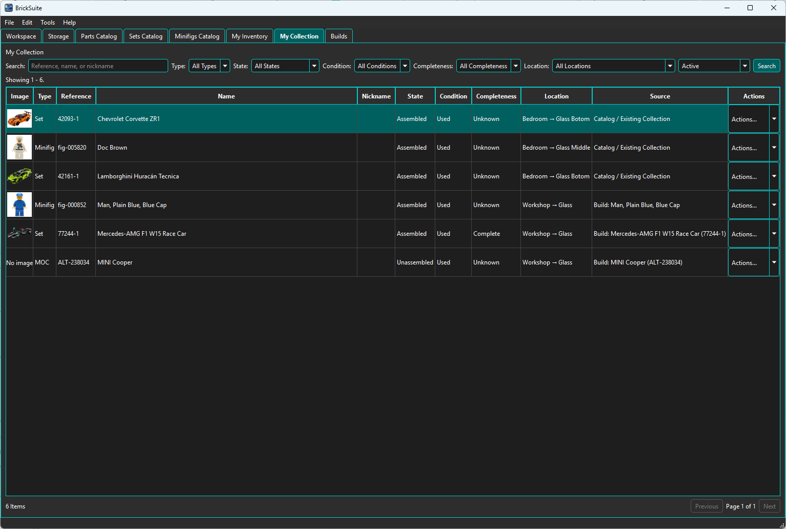

# BrickSuite

**The Digital Twin Platform for Your Brick Workshop**

BrickSuite is a free, open-source desktop application for keeping a traceable digital record of a physical brick workshop. It connects reference catalogs, loose inventory, storage, Builds, and owned models without treating those concepts as interchangeable.

> **Current release:** BrickSuite **v0.3.0**
>
> **Windows:** packaged installer available from the GitHub Releases page
>
> **macOS / Linux:** source builds supported; packaged distributions remain deferred

The [online User Guide](https://rayjr2.github.io/BrickSuite/) is also built into BrickSuite under **Help → BrickSuite Help**.


## What BrickSuite Does

- **Catalogs** — maintain searchable local Parts, Sets, and Minifigs reference data from Rebrickable, with Set enrichment and instructions from Brickset where configured.
- **Part identity** — resolve aliases, relationships, and persisted Rebrickable or BrickLink external identifiers. The non-modal **Part Reference** organizes 2,955 commonly used parts into 37 visual families.
- **My Inventory** — record exact Part, Color, quantity, Manufacturer, condition, ownership, and Storage location, with correction, movement, Lost/Found, and history workflows.
- **Builds** — manage Set, Minifig, and MOC requirements through allocation, substitution, shortages, interactive pulling, reconciliation, completion, cancellation, and disassembly.
- **My Collection** — record individual physical Sets, Minifigs, and MOCs independently from loose inventory and Build history, including State, Condition, Completeness, Location, nickname, and notes.
- **Storage** — organize hierarchical locations and control whether active leaf locations may hold Inventory, Collection items, or Both.
- **Database safety** — inspect database integrity and foreign keys, create manual backups, and optionally run verified automatic backups with retention.

BrickSuite preserves stable identities and operational history. Records referenced by inventory, Builds, or Collection history are generally moved through explicit lifecycle states, archived, or deactivated rather than silently deleted.

## Catalog → Inventory → Build → Collection

BrickSuite's major workflows form a connected sequence:

1. Import local Parts, Sets, and Minifigs catalogs from supported Rebrickable CSV or ZIP downloads.
2. Record loose physical pieces in **My Inventory**, directly or through previewed import/receiving workflows.
3. Create catalog-linked Set or Minifig Builds, or define/import MOC requirements. Catalog-linked Builds retain requirement snapshots, so later catalog refreshes do not rewrite existing Build history.
4. Allocate exact inventory, use deliberate requirement substitutions where needed, pull pieces interactively or through pull-list reconciliation, and complete or disassemble the Build.
5. Add a catalog item or eligible completed Build to **My Collection** as an individual physical model.

An intact **Complete Set** workflow is distinct from **Create Build From Stock**: a Complete Set does not consume loose inventory to assemble its requirements, while a Stock Build follows normal allocation and pulling.

## Providers, Identity, and Provenance







- **Rebrickable** supplies catalog, composition, relationship, and identity data through downloads and selected API operations.
- **Brickset** optionally enriches Set Details and provides instruction information.
- **BrickLink IDs** are stored and used as external/cross-reference identities; BrickSuite does not claim to write catalog data back to BrickLink.
- **Manufacturer** describes the physical provenance of inventory. It is not a catalog provider identity.

Users provide their own API credentials under **Settings → APIs**. Bulk catalog imports and many local workflows work without continuous network access. Credentials remain local and must never be included in bug reports, screenshots, logs, or commits.

## Local Data, Privacy, and Database Safety

BrickSuite stores its SQLite database, application log, and image cache beneath Qt's `AppLocalDataLocation`. On Windows this is normally:

```text
%LOCALAPPDATA%\RFStateSide\BrickSuite\
```

Interface preferences are stored through `QSettings`. Uninstalling BrickSuite intentionally does not delete the user's database or application data.

**File → Backup Database** is an explicit manual preservation workflow. Optional automatic backups first validate the live database, create and verify a SQLite snapshot, then apply retention only to recognized automatic backups in the current schema-version directory. Database health and recovery guidance are available under **Tools → Database Status & Integrity**.

## Installation and Platform Support

### Windows

Published Windows releases use an installer assembled with Qt's `windeployqt` and Inno Setup. Use the installer attached to the matching GitHub Release when available.

### macOS and Linux

BrickSuite is supported as a source build on macOS and Linux. Packaged macOS and Linux distributions are not currently provided.

## Quick Start

1. Start BrickSuite and create or select a Workspace.
2. Create a Storage hierarchy and choose whether leaf locations are usable for Inventory, Collection, or Both.
3. Optionally configure Rebrickable and Brickset under **Settings → APIs**.
4. Import the Parts, Sets, and Minifigs reference catalogs. Parts and Sets accept their Rebrickable CSV files or downloaded ZIP files directly.
5. Add or import loose pieces in **My Inventory**.
6. Create Set, Minifig, or MOC Builds and use allocation, Missing Parts, and pulling workflows as needed.
7. Record owned models in **My Collection** from a catalog or eligible completed Build.
8. Review **Settings → Database Backup** and create a manual backup before major data changes.

See the built-in **Quick Start** topic for exact provider files and workflow details.

## Building from Source

BrickSuite v0.3.0 uses C++17, Qt 6.10.3 (Core, Gui, Widgets, Sql, and Network), SQLite through Qt's QSQLITE driver, ZLIB, and CMake 3.16 or newer.

The reference Windows environment is Qt 6.10.3 MinGW 64-bit. BrickSuite is also built from source on macOS and Linux.

```bash
cmake -S . -B build -DCMAKE_PREFIX_PATH=/path/to/Qt/6.10.3/<kit>
cmake --build build
```

The platform's ZLIB development package must be discoverable by CMake. Qt Creator can open `CMakeLists.txt` directly and configure an installed Qt kit.

## Help, Contributions, and License

- Read the [BrickSuite User Guide](https://rayjr2.github.io/BrickSuite/).
- Use the repository's issue templates for bugs and feature requests.
- Include the version from **Help → About BrickSuite** and only the smallest relevant, sanitized log excerpt.
- See [CONTRIBUTING.md](CONTRIBUTING.md) for development guidance.

BrickSuite is licensed under the **GNU Lesser General Public License, version 3.0 only (LGPL-3.0-only)**. See [LICENSE](LICENSE) and [THIRD_PARTY_NOTICES.md](THIRD_PARTY_NOTICES.md).

LEGO® is a trademark of the LEGO Group, which does not sponsor, authorize, or endorse BrickSuite. Rebrickable, Brickset, and BrickLink are third-party names; BrickSuite is independent of those providers.

Copyright © 2026 RF StateSide, LLC.
