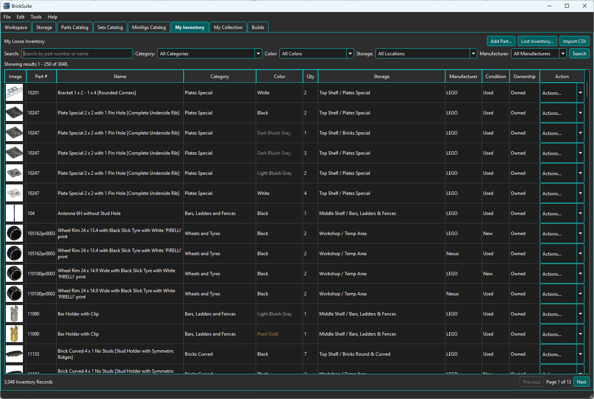
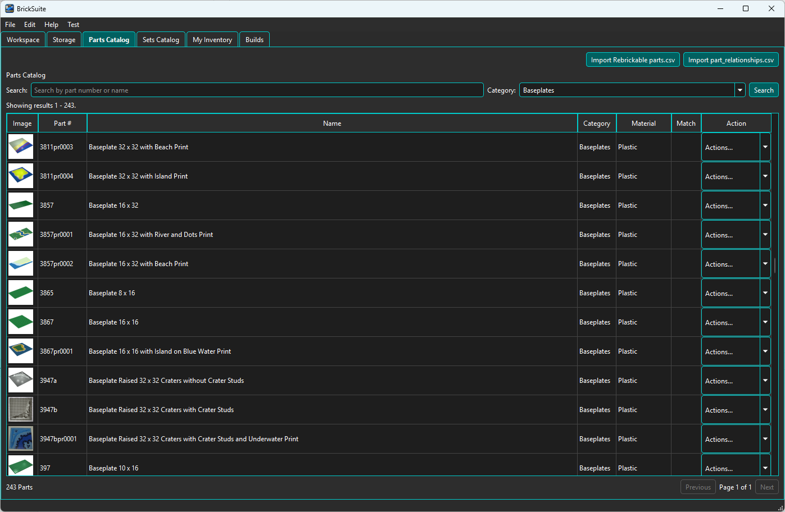
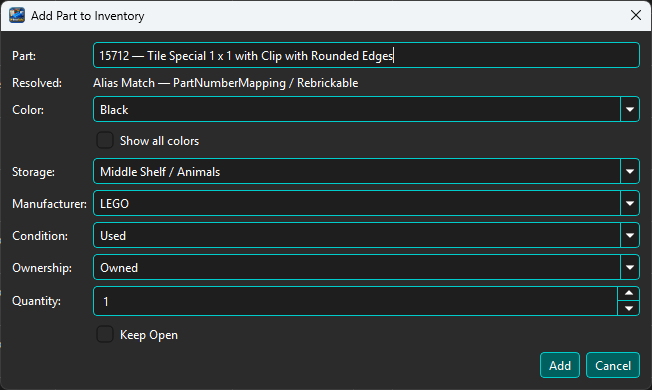
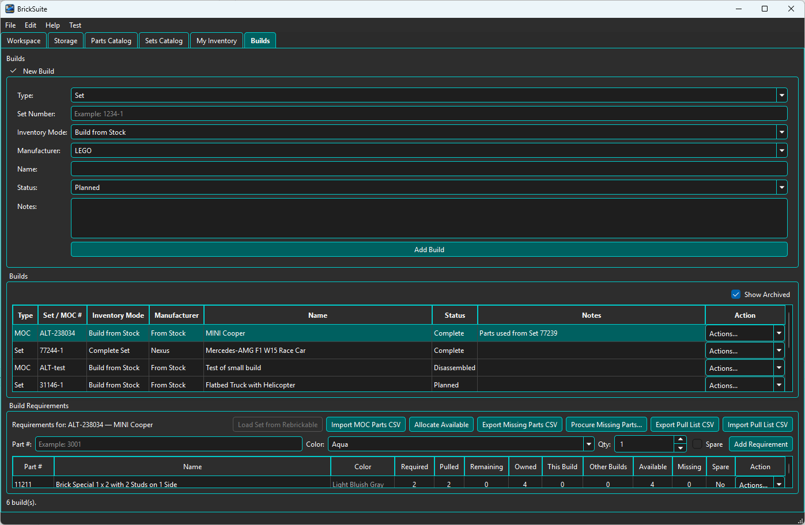
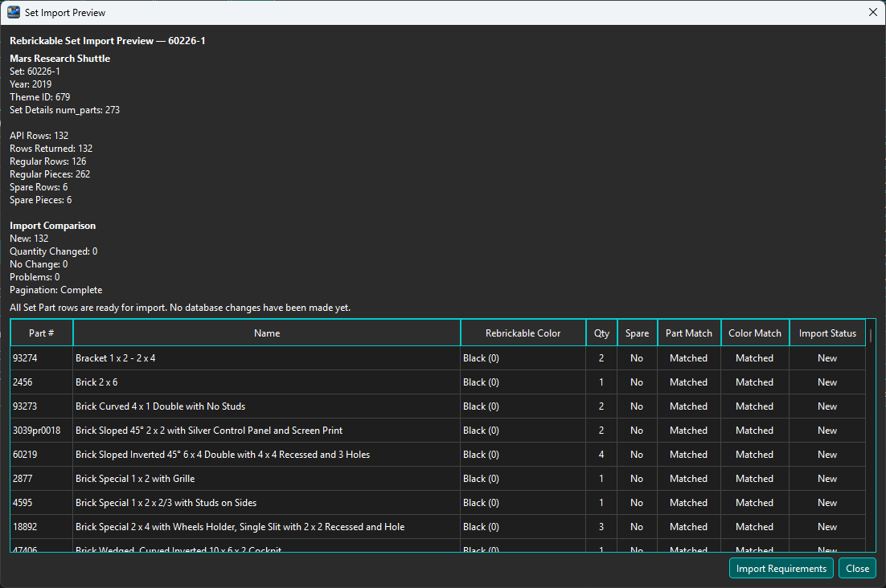

# BrickSuite

**The Digital Twin Platform for Your Brick Workshop**

BrickSuite is a free and open-source desktop application for managing a physical brick collection as a digital twin. It combines hierarchical storage, loose-part inventory, searchable reference catalogs, Sets and MOCs, Build planning, part identity resolution, inventory synchronization, missing/lost-part workflows, and local history in one application.

BrickSuite is designed around a simple principle: **your physical inventory, storage locations, and Build activity should remain traceable**. Records that may be referenced elsewhere are preserved, deactivated, archived, or transitioned through lifecycle states rather than casually deleted.

> **Current release:** BrickSuite **v0.2.0**  
> **Windows:** packaged installer supported  
> **macOS / Linux:** source builds validated; packaged distributions are planned for later work



## What BrickSuite Does

BrickSuite is intended for brick collectors and builders who want to know not only *what* parts they own, but **where they are, how they got there, and whether they are available for a Build**.

Major capabilities include:

- **Workspaces and hierarchical Storage** — model areas, cabinets, shelves, cases, drawers, bins, trays, compartments, and dividers.
- **My Inventory** — track part, color, manufacturer, quantity, condition, ownership, and physical Storage location.
- **Inventory history and provenance** — preserve quantity changes, moves, imports, Build activity, Lost/Found activity, and other movements.
- **Parts Catalog** — maintain a large local Rebrickable-backed reference catalog with images, materials, relationships, external IDs, and identity mappings.
- **Sets Catalog** — browse local Set reference data with Rebrickable support and optional Brickset enrichment.
- **Part Resolver** — resolve exact, alternate, aliased, older, superseded, and provider-specific part identities to the catalog identity BrickSuite uses.
- **Rebrickable inventory synchronization** — Append, Replace, Subtract, and Compare Only workflows with previews and provenance-aware inventory handling.
- **Sets, MOCs, and Builds** — create requirements, allocate available inventory, identify shortages, pull parts, reconcile results, complete Builds, and preserve lifecycle history.
- **Complete Set workflows** — populate a Build from a Set's complete requirements, release spare pieces to loose inventory, and later disassemble the Set back into Storage.
- **Missing Parts procurement** — review shortages and export data for external purchasing/wanted-list workflows.
- **Lost and Found** — record lost Build inventory and return found pieces to loose Storage without losing history.
- **Backup / Restore and diagnostics** — integrated SQLite backup/restore, application logging, and troubleshooting tools.
- **Light and Dark themes** with persistent application preferences.
- **Check for Updates** — manually check the public BrickSuite GitHub update manifest from the Help menu.

## Parts Catalog and Identity Resolution

BrickSuite keeps a local reference catalog so common inventory and Build operations do not depend on making a web request for every lookup.



Rebrickable `parts.csv` and `part_relationships.csv` data can be imported to refresh the catalog and relationship information. Catalog records are updated or added rather than deleted simply because they disappear from a later provider file.

### Part Resolver

Physical bricks, older inventories, and different providers do not always use the same part number for a related design. BrickSuite's Part Resolver makes that identity work visible instead of silently treating every number as an unrelated part.



The resolver can report direct catalog selections as well as supported alias/mapping matches. This helps keep inventory and Build requirements associated with the appropriate catalog identity.

## Builds, Sets, and MOCs

BrickSuite compares Build requirements with available loose inventory and supports the workflow from planning through allocation, pulling, completion, cancellation, archive, or disassembly.



**Allocate Available** automatically allocates matching loose inventory to requirements, reducing repetitive manual allocation for larger Sets and MOCs. Missing requirements remain visible and can feed the Missing Parts procurement/export workflow.

### Complete Set Builds

A new Build of **Type: Set** can use **Mode: Complete Set**. BrickSuite retrieves the Set requirements and presents an import preview before anything is committed.



The preview reports regular/spare quantities, matching information, and problems before the requirements are imported. Once the Set is in use, spare pieces can be released to My Loose Inventory. A completed Set can later be disassembled, returning selected quantities to chosen Storage locations while preserving Build and movement history.

For MOCs, Rebrickable CSV requirements can be imported. The `Is Spare` column is optional; when it is absent, BrickSuite treats the imported rows as non-spare requirements.

## Rebrickable and Brickset

BrickSuite uses provider integrations selectively rather than making its local database dependent on constant network access.

### Rebrickable

Rebrickable is the primary source for reference catalog imports and several API-backed operations. BrickSuite includes conservative centralized request throttling, connection testing, image caching, and fallback behavior intended to avoid unnecessary API traffic.

Users supply their own Rebrickable API key in **Settings → APIs → Rebrickable**.

### Brickset

Brickset is an optional enrichment provider for Set details and instructions. When configured and within the user-defined daily request threshold, BrickSuite can show additional Set metadata and available instruction links. When Brickset is unavailable or over the configured threshold, BrickSuite falls back to Rebrickable-backed Set information where supported.

Users supply their own Brickset API key in **Settings → APIs → Brickset**.

**API credentials are stored locally. Never post API keys, passwords, tokens, or other credentials in a public GitHub issue.**

## Installation

### Windows

BrickSuite v0.2.0 has an automated Windows packaging workflow using Qt's `windeployqt` and Inno Setup. The resulting installer includes the Qt runtime dependencies required by BrickSuite and presents the LGPL license during installation.

For published versions, use the installer attached to the corresponding GitHub Release.

> The first public v0.2.0 release package will be published as part of the release milestone. Until a release asset is present, developers can build BrickSuite from source using the instructions below.

### macOS and Linux

BrickSuite has been built successfully from source on macOS and Ubuntu Linux. Packaged macOS/Linux distributions are not yet part of the v0.2.0 release scope.

## Quick Start

After installing or building BrickSuite:

1. Start BrickSuite and create/select your Workspace.
2. Open **Settings → APIs** and enter your Rebrickable API key. Brickset is optional but enables additional Set enrichment and instruction features.
3. Create your physical Storage hierarchy.
4. Download the current Rebrickable catalog files, unzip them, and use the import buttons in **Parts Catalog** and **Sets Catalog** to refresh the local reference data.
5. Import `part_relationships.csv` so BrickSuite has relationship data for Part Resolver and related workflows.
6. Import owned inventory as needed, or begin entering loose parts directly in **My Inventory**.
7. Create Sets/MOCs/Builds and use Allocate Available, Missing Parts, pull/reconciliation, Complete Set, and other workflows as appropriate.

BrickSuite also contains a detailed built-in Help system with screenshots and step-by-step instructions.

> **Online User Guide:** [BrickSuite Help](https://rayjr2.github.io/BrickSuite/)

## Building from Source

BrickSuite v0.2.0 is implemented with:

- **C++17**
- **Qt 6.10.3**
- **Qt Widgets**
- **Qt SQL**
- **Qt Network**
- **SQLite**
- **CMake**

The primary Windows development configuration uses the Qt 6.10.3 MinGW 64-bit toolchain. BrickSuite has also been built successfully on macOS and Ubuntu Linux.

The CMake project requires these Qt 6 modules:

- Core
- Gui
- Widgets
- Sql
- Network

A typical command-line configuration is:

```bash
cmake -S . -B build -DCMAKE_PREFIX_PATH=/path/to/Qt/6.10.3/<kit>
cmake --build build
```

The exact Qt kit path and generator vary by operating system and development environment. Qt Creator can also open the repository's `CMakeLists.txt` directly and configure an installed Qt 6 kit.

### SQLite

BrickSuite uses SQLite through Qt SQL. A separate SQLite command-line installation is not required to run BrickSuite when the Qt SQLite driver is available.

Developers may optionally install SQLite command-line tools for database inspection and troubleshooting.

## Local Application Data

BrickSuite uses Qt's `AppLocalDataLocation` for application-managed local data.

On Windows this normally resolves beneath:

```text
%LOCALAPPDATA%\RFStateSide\BrickSuite\
```

This location contains application-managed data such as the live SQLite database, log, and image cache. User-interface preferences are stored through `QSettings`.

Uninstalling BrickSuite intentionally does **not** delete the user's local BrickSuite database or other application data.

## Help, Bugs, and Feature Requests

BrickSuite includes an extensive built-in Help system under the **Help** menu.

For GitHub:

- Use the **Bug report** issue template for reproducible problems.
- Use the **Feature request** template for enhancement ideas.
- Include the BrickSuite version from **Help → About** when reporting a bug.
- Include only the smallest relevant Application Log excerpt when it helps diagnosis.
- **Never include API keys, passwords, tokens, private certificates, or other credentials in a public issue.**

Contributor guidance is available in [`CONTRIBUTING.md`](CONTRIBUTING.md).

## Project Status

**BrickSuite v0.2.0** is the current release line.

The v0.2.0 work expands the original baseline with API-provider architecture and Brickset enrichment, Missing Parts procurement/export, Rebrickable inventory comparison/synchronization, manufacturer/provenance and part identity work, catalog/inventory enhancements, Complete Set and Build workflow improvements, cross-platform preparation, automated Windows packaging, update checking, and a comprehensive Help refresh.

The project is developed incrementally using defined milestones, regression testing, and real-world workshop use.

## Acknowledgments

BrickSuite was designed and developed by RF StateSide, LLC with development assistance from OpenAI's ChatGPT, including support with software design, code review, documentation, testing strategy, and implementation.

## License

Copyright © 2026 RF StateSide, LLC.

BrickSuite is free and open-source software licensed under the **GNU Lesser General Public License, version 3.0 (LGPL-3.0-only)**.

See [`LICENSE`](LICENSE) for the complete license terms.

## Third-Party and Trademark Notice

LEGO® is a trademark of the LEGO Group of companies, which does not sponsor, authorize, or endorse BrickSuite.

Rebrickable and Brickset are trademarks or brand names of their respective owners. BrickSuite is an independent application and is not affiliated with or endorsed by those providers.

See [`THIRD_PARTY_NOTICES.md`](THIRD_PARTY_NOTICES.md) for additional notices and acknowledgments.

---

**BrickSuite**  
*The Digital Twin Platform for Your Brick Workshop*
