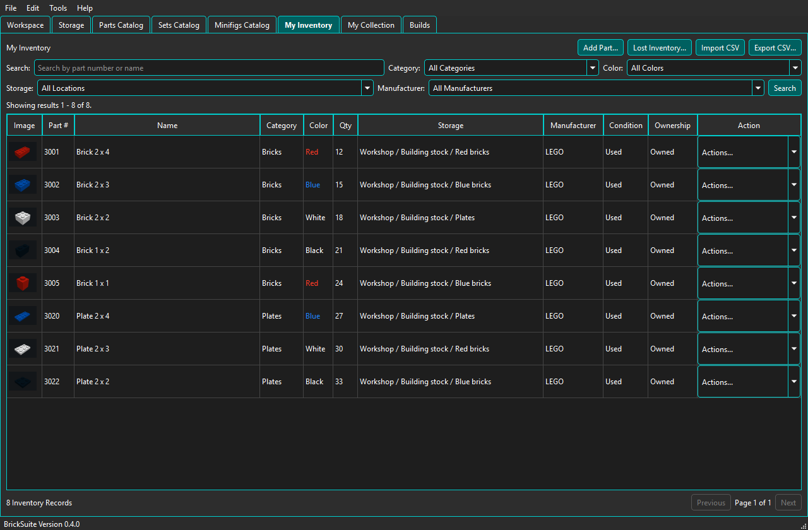
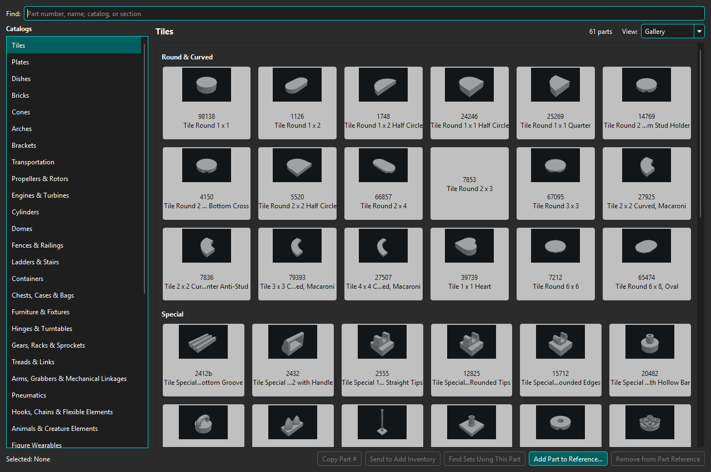
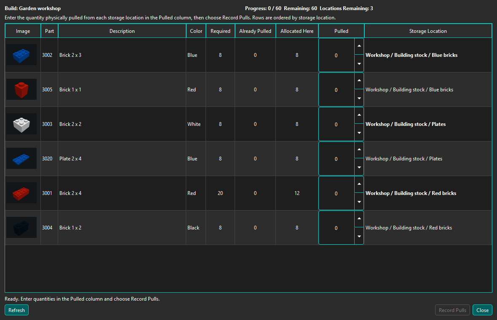
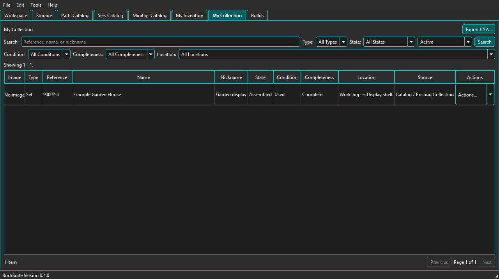

# BrickSuite

**The Digital Twin Platform for Your Brick Workshop**

BrickSuite is a free, open-source desktop application for keeping a traceable digital record of a physical brick workshop. It connects reference catalogs, loose inventory, storage, Builds, and owned models without treating those concepts as interchangeable.

> **BrickSuite v0.4.0 — 2026-10-07**
>
> **Downloads:** [GitHub Releases](https://github.com/RayJr2/BrickSuite/releases) — Windows x64, macOS ARM64 / Intel, and Linux x86_64. See [Release Platforms](#release-platforms) for requirements and validation status.

The [online User Guide](https://rayjr2.github.io/BrickSuite/) is also built into BrickSuite under **Help → BrickSuite Help**.



## What BrickSuite Does

- **Catalogs** — maintain searchable local Parts, Sets, and Minifigs reference data from Rebrickable, with Set enrichment and instructions from Brickset where configured.
- **Part identity** — resolve aliases, relationships, and persisted Rebrickable or BrickLink external identifiers. The non-modal **Part Reference** organizes commonly used Parts into visual families and dimension views.
- **My Inventory** — record exact Part, Color, quantity, Manufacturer, condition, ownership, and Storage location, with correction, movement, Lost/Found, and history workflows.
- **Builds** — manage Set, Minifig, and MOC requirements through allocation, substitution, shortages, interactive pulling, reconciliation, completion, cancellation, and disassembly.
- **My Collection** — record individual physical Sets, Minifigs, and MOCs independently from loose inventory and Build history, including State, Condition, Completeness, Location, nickname, and notes.
- **Storage** — organize hierarchical locations, including Box, and control whether active leaf locations may hold Inventory, Collection items, or Both.
- **Use Set for Parts** — preview a catalog Set’s composition and add its loose pieces directly to Inventory, with copies, optional catalog spares, condition, and an active leaf Storage destination. This local/Host workflow is unavailable on Remote Clients and is distinct from disassembling an owned Collection item.
- **What Can I Build / procurement** — compare catalog requirements with available stock, review shortages, and export supported procurement formats, including Rebrickable CSV. Rebrickable Custom List API creation is not implemented.
- **Host / Remote** — use a BrickSuite Host through paired, trusted Remote clients; shared data and local settings remain distinct.
- **3D models and printing** — view installed LDraw models or local LDraw files, prepare supported geometry, and export nominal or supported profile-corrected output. Readiness and fit coverage are reported per model; not every Part is printable.
- **LEGO Fit Calibration** — generate managed single-family or multi-family calibration packages, record physical observations, verify evidence, and create compatible Fit Profiles. Local repaired overrides do not automatically gain fit ownership.
- **Database safety** — inspect database integrity and foreign keys, create manual backups, and optionally run verified automatic backups with retention.

BrickSuite preserves stable identities and operational history. Records referenced by inventory, Builds, or Collection history are generally moved through explicit lifecycle states, archived, or deactivated rather than silently deleted.

## Catalog → Inventory → Build → Collection

BrickSuite's major workflows form a connected sequence:

1. Import local Parts, Sets, and Minifigs catalogs from supported Rebrickable CSV or ZIP downloads.
2. Record loose physical pieces in **My Inventory**, directly or through previewed import/receiving workflows.
3. Create catalog-linked Set or Minifig Builds, or define/import MOC requirements. Catalog-linked Builds retain requirement snapshots, so later catalog refreshes do not rewrite existing Build history.
4. Allocate exact inventory, use deliberate requirement substitutions where needed, pull pieces interactively or through pull-list reconciliation, and complete or disassemble the Build.
5. Add a catalog item or eligible completed Build to **My Collection** as an individual physical model.

An intact **Complete Set** workflow is distinct from **Create Build From Stock**: a Complete Set does not consume loose inventory to assemble its requirements, while a Stock Build follows normal allocation and pulling.

## Providers, Identity, and Provenance







- **Rebrickable** supplies catalog, composition, relationship, and identity data through downloads and selected API operations.
- **Brickset** optionally enriches Set Details and provides instruction information.
- **BrickLink IDs** are stored and used as external/cross-reference identities; BrickSuite does not claim to write catalog data back to BrickLink.
- **Manufacturer** describes the physical provenance of inventory. It is not a catalog provider identity.

Users provide their own API credentials under **Settings → APIs**. Bulk catalog imports and many local workflows work without continuous network access. Credentials remain local and must never be included in bug reports, screenshots, logs, or commits.

## Local Data, Privacy, and Database Safety

BrickSuite stores its SQLite database, application log, and image cache beneath Qt's `AppLocalDataLocation`. On Windows this is normally:

```text
%LOCALAPPDATA%\RFStateSide\BrickSuite\
```

Interface preferences are stored through `QSettings`. Uninstalling BrickSuite intentionally does not delete the user's database or application data.

**File → Backup Database** is an explicit manual preservation workflow. Optional automatic backups first validate the live database, create and verify a SQLite snapshot, then apply retention only to recognized automatic backups in the current schema-version directory. Database health and recovery guidance are available under **Tools → Database Status & Integrity**.

## Release Platforms

BrickSuite v0.4.0 provides the following platform packages. Build/CI validation and manual runtime acceptance are listed separately; deployment targets do not imply testing on every OS version.

| Platform | Artifact | Baseline / Validation status |
| --- | --- | --- |
| Windows x64 | `.exe` installer assembled with Qt's `windeployqt` and Inno Setup | Primary validated platform; use the installer attached to the matching GitHub Release. |
| macOS ARM64 / Apple Silicon | `BrickSuite-v0.4.0-macOS-arm64.zip` | macOS **13.0 or newer** deployment target; physical Apple Silicon runtime accepted on a Mac mini. Final release builds receive another exact-artifact smoke check. |
| macOS x86_64 / Intel | `BrickSuite-v0.4.0-macOS-x86_64.zip` | macOS **13.0 or newer** deployment target; GitHub Actions built and CI-validated. Manual Intel runtime acceptance remains pending. |
| Linux x86_64 | Portable installer tarball: `BrickSuite-v0.4.0-Linux-x86_64.tar.gz` | Release baseline: **Ubuntu 22.04 LTS / glibc 2.35**. Forward compatibility was also validated on Ubuntu 26.04. |

For Windows, download the x64 installer from the [matching GitHub Release](https://github.com/RayJr2/BrickSuite/releases), close BrickSuite, and follow the installer. See [Windows installation and packaging](deployment/windows/README.md).

BrickSuite macOS builds are currently **ad-hoc signed and are not Apple notarized**. The project does not currently use an Apple Developer ID certificate, so macOS may require additional confirmation before first launch. See the [macOS deployment notes](deployment/macos/README.md).

On Ubuntu, extract the Linux archive and run `./install.sh` from its `BrickSuite` directory. The installer checks runtime prerequisites and asks for consent before installing missing Ubuntu packages. It installs to `/opt/BrickSuite`; launch from the application menu or run `bricksuite`. Automatic installation supports Ubuntu 22.04 or newer on x86_64, not arbitrary Linux distributions. Packages built locally on newer Ubuntu are development artifacts, not the Ubuntu 22.04 baseline release. See the [Linux installation instructions](deployment/linux/RUNTIME.md).

## Quick Start

1. Start BrickSuite and create or select a Workspace.
2. Create a Storage hierarchy and choose whether leaf locations are usable for Inventory, Collection, or Both.
3. Optionally configure Rebrickable and Brickset under **Settings → APIs**.
4. Import the Parts, Sets, and Minifigs reference catalogs. Parts and Sets accept their Rebrickable CSV files or downloaded ZIP files directly.
5. Add or import loose pieces in **My Inventory**.
6. Create Set, Minifig, or MOC Builds and use allocation, Missing Parts, and pulling workflows as needed.
7. Record owned models in **My Collection** from a catalog or eligible completed Build.
8. Review **Settings → Database Backup** and create a manual backup before major data changes.

See the built-in **Quick Start** topic for exact provider files and workflow details.

## Building from Source

The current checkout uses C++17, Qt 6.10.3 (Core, Gui, Widgets, Sql, Network, WebSockets, Concurrent, OpenGL, and OpenGLWidgets), SQLite through Qt’s QSQLITE driver, ZLIB, OpenSSL 3 (Crypto), and CMake 3.16 or newer. CMake downloads pinned MCUT/mio and lib3mf sources, including lib3mf submodules; first configuration needs network access or the documented source overrides.

The reference Windows environment is Qt 6.10.3 MinGW 64-bit. BrickSuite is also built from source on macOS and Linux.

```bash
cmake -S . -B build -DCMAKE_PREFIX_PATH=/path/to/Qt/6.10.3/<kit>
cmake --build build
```

ZLIB and OpenSSL development files must be discoverable by CMake. Qt Creator can open `CMakeLists.txt` directly. See [CONTRIBUTING](CONTRIBUTING.md) for testing and [Windows](deployment/windows/README.md), [macOS](deployment/macos/README.md), and [Linux](deployment/linux/README.md) for packaging. The official Linux baseline builder is `python3 deployment/linux/build_release_artifact.py`; Qt Creator Deploy creates a local host-ABI development package only.

## Support BrickSuite

BrickSuite is free and open-source software. If you find it useful and would like to support continued development, testing, documentation, and maintenance, you can make a voluntary contribution through PayPal.

Support is completely optional and does not unlock additional features or services. Payments are handled by PayPal, not by BrickSuite.

[Support BrickSuite with PayPal](https://www.paypal.com/ncp/payment/WB8RKBVN6DTYW)

## Help, Contributions, and License

- Read the [BrickSuite User Guide](https://rayjr2.github.io/BrickSuite/).
- Use the repository's issue templates for bugs and feature requests.
- Include the version from **Help → About BrickSuite** and only the smallest relevant, sanitized log excerpt.
- See [CONTRIBUTING.md](CONTRIBUTING.md) for development guidance.

BrickSuite is licensed under the **GNU Lesser General Public License, version 3.0 only (LGPL-3.0-only)**. See [LICENSE](LICENSE) and [THIRD_PARTY_NOTICES.md](THIRD_PARTY_NOTICES.md).

LEGO® is a trademark of the LEGO Group, which does not sponsor, authorize, or endorse BrickSuite. Rebrickable, Brickset, and BrickLink are third-party names; BrickSuite is independent of those providers.

Copyright © 2026 RF StateSide, LLC.
