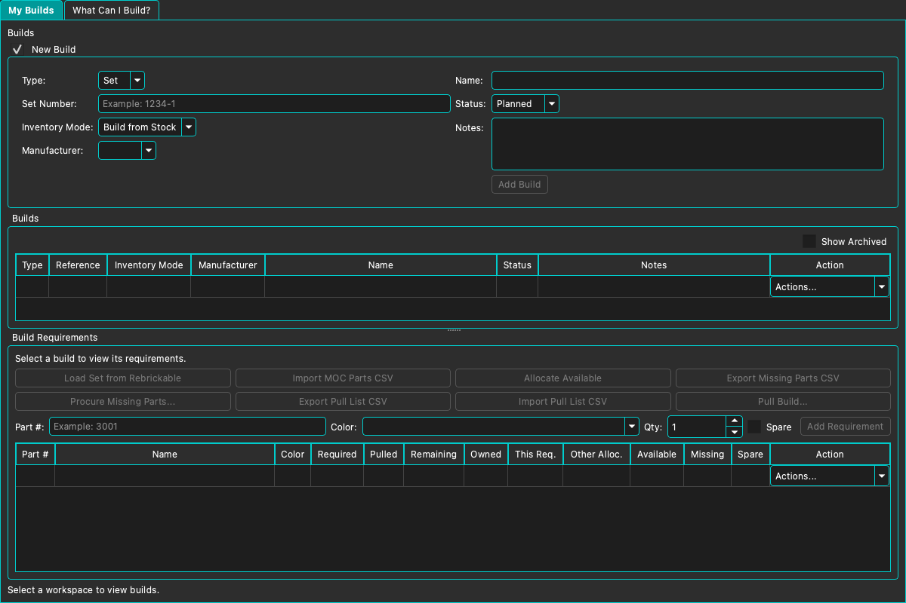
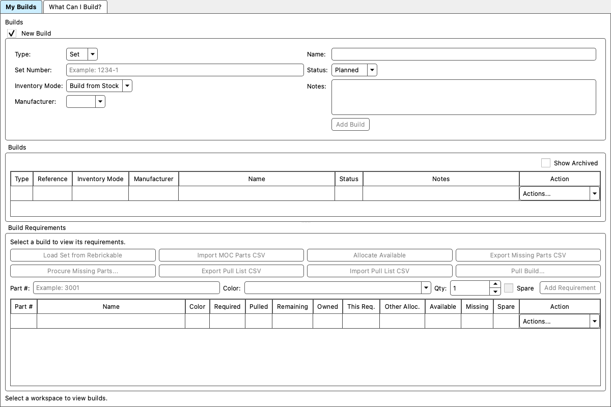

# M39 Phase 1 — macOS readiness audit

Follow-up: [M39.1A runtime closure](m39-1a-runtime-closure.md) records the later 115/115 result, shared macOS worker watchdog, proven TLS backend requirement, and native layout acceptance. Results below describe the original audit.

Audit date: 2026-09-28. Starting commit: `3a891f0` (M38 tooltip/context Help complete). The working tree was clean before this audit. Schema 35 and Protocol 1.5 are unchanged. No commit or push; no Linux work, CI implementation, geometry redesign, or production restore.

## Scope and evidence

This is a development-machine audit, not release acceptance. Distinguish source review, synthetic tests, native UI observations, and outstanding two-machine/clean-machine acceptance. The request reports prior successful macOS Host operation and Windows/macOS connectivity; those historical results are not newly verified here.

## 1. Environment

- macOS 26.7, build 25G229; native arm64.
- Qt 6.10.3 macOS kit; QtCore contains x86_64 and arm64 slices.
- Xcode 26.1.1 (17B100), Apple Clang 17.0.0 (clang-1700.4.4.1), macOS 26.1 SDK.
- Bundled CMake 3.30.5. CMake is not on the default shell PATH.
- Fresh Release build: `build/m39-audit-release`; Debug: existing Qt 6.10.3 Debug build directory.
- Application: `BrickSuite.app/Contents/MacOS/BrickSuite`, with sibling `BrickSuiteMeshBooleanWorker`.
- OpenSSL 3.6.4 from Homebrew is arm64-only. System zlib is SDK version 1.2.12.
- Release configure reused the already populated pinned MCUT and lib3mf source directories through `FETCHCONTENT_SOURCE_DIR_MCUT` and `FETCHCONTENT_SOURCE_DIR_LIB3MF`; compiled outputs were fresh. Debug fetched its pinned dependencies with network permission.
- An initial clean build under the `/tmp` → `/private/tmp` alias failed on relative moc include paths. Moving to a fresh non-aliased repository build directory resolved that build-location problem without source changes.

## 2. Build and tests

Fresh Release and Debug application builds succeeded. All 115 configured test executables built. The final full CTest run with the installed OpenSSL runtime discoverable reports **110 passed, 5 failed, 0 skipped**; default-environment results and failure classification are recorded below.

The configured suite has 115 tests without an installed LDraw root. Eight additional source-backed cases are not registered: six calibration family integrations, `PrintCompositionRouting`, and `PrintPreparation3021`. This is absence of prerequisites, not eight CTest skips. Do not run the full corpus to close this audit.

The explicit test build exposed missing macOS Keychain framework linkage in five targets: `PartExternalIdEnrichmentServiceTest`, `AutomaticBackupServiceTest`, `DatabaseRecoveryGuidanceTest`, `MinifigPartsApiTest`, and `SetPartsApiTest`. Security linkage was added, and targets using CredentialStore now explicitly link CoreFoundation rather than relying on a transitive GUI dependency. Windows/Linux link behavior is unchanged. A second test-only fix captures HostReadExecutor request IDs by value so asynchronous callbacks cannot reference a destroyed local variable.

Compiler diagnostics include deprecated SecKeychain functions; third-party lib3mf sprintf, deprecated-copy, non-virtual-destructor, missing-override and macro-redefinition warnings. No dependency code was edited.

`PartReferenceAuditTest` conditionally omits its Windows native access/lock-error cases on macOS. These are internal platform exclusions, not whole-test skips.

## 3. Runtime and layout

Native baseline launch succeeded. Workspace and Storage correctly displayed unavailable Host state. Parts Catalog rendered local records, images, filters, pagination, and action combos. Builds, Settings General/Appearance/3D Models, and built-in Builds Help were opened. The configured data source was Remote and its Host was unavailable. No live workshop mutation was attempted.

The supplied screenshot and native observation show a centered, narrow New Build form taking most of the upper page, plus a requirements status and eight actions on one horizontal line. Source review confirms QFormLayout platform defaults and an unwrappable QHBoxLayout, rather than a Windows-only width constant, cause these particular constraints.

Changes in `BuildsWidget.cpp`:

- Split the existing New Build fields into two form columns, with explicit left/top alignment, expanding fields, and long-row wrapping. Add Build stays a normally sized button.
- Separate the wrapping requirement status from the action controls; place the eight existing actions in two rows of four, sized by Qt layout hints.
- Size Build and requirement table rows to their contents, including embedded Action combos.
- Keep requirement entry, actions, signals, split-pane persistence, paging, and business rules intact.

The first native intermediate layout confirmed the new action arrangement but exposed excess vertical space from the original eight-row form; the two-column refinement addresses that. Final theme/size acceptance is recorded below. Exact minimum practical whole-window size must include all stacked pages, not just Builds. Until measured, do not claim that 1200×800 is accepted. Narrower layouts must preserve full action labels and scroll tables; collapsing New Build must still free table space. Wider layouts should grow fields and table space without hiding actions.

Other reviewed risks, not asserted as reproduced defects: Inventory has long horizontal filter rows and a fixed 52-pixel table row height; catalog action editors appeared adequately sized in native observation; Inventory populated-row acceptance is pending. Procurement and pulling contain dense horizontal controls. The 3D viewport imposes a 500×350 minimum, calibration starts at 980×760, and Settings starts at 600×500 but grows to its layout minimum. Add/Edit/Move Inventory, procurement, pulling, export/override/package dialogs, and narrower Settings Server/API layouts remain runtime acceptance items. No speculative broad UI changes were made.

## 4. Native menus and keyboard

Qt relocated About BrickSuite and Settings (shown as Preferences) into the native BrickSuite application menu; native Quit is present. Baseline File, Tools, and Help menus were available. Edit has only Settings in source and can disappear when Qt relocates its sole action; that is not lost functionality. Release does not expose the Debug-only Test menu.

Help uses `QKeySequence::HelpContents`; plain F1 sent through automation did not visibly open Help in the initial check, while the Help menu did. Treat physical F1/function-key and platform Help shortcut acceptance as pending rather than changing the frozen Help architecture based on one automation event. Source contains no explicit Preferences, Close, Quit, or Find standard shortcut assignment. Qt text editors provide normal platform editing behavior, but Cmd+C/V, Cmd+comma, Cmd+W, search focus, and actual keyboard Quit still require acceptance. No Windows Ctrl strings were found in the scanned UI shortcut definitions.

## 5. Resources, Help, and paths

Help HTML and images are compiled by `resources/help/help.qrc`; application resources use `resources/resources.qrc`. Builds Help rendered its embedded screenshot. Help navigation resolves `:/help` / `qrc:/help` resources, not the checkout. Printing topics are included in that same resource collection. Appearance exposes the explanatory-tooltip preference.

Source review found these runtime locations:

| Data | Location policy |
| --- | --- |
| Database, logs, image caches | QStandardPaths AppLocalDataLocation (macOS Application Support) |
| Host certificate, epoch, pairing metadata | Application Support; private identity/credentials go through CredentialStore |
| Local printable overrides | AppLocalDataLocation/printable-overrides |
| Calibration workspaces | AppDataLocation/LegoCalibration |
| Print Capability Audit | Documents/BrickSuite/Print Capability Audits |
| Manual backup initial destination | Documents, home fallback; user-selected path |
| Automatic backup | Documents/BrickSuite Backups/database, Application Support fallback |
| MCUT exchange files | QTemporaryDir; bounded binary protocol |
| LDraw | User-selected installed folder, persisted in settings |

The D:/ backup preference is inside Q_OS_WIN. Scanned production path construction does not require a Windows drive or source checkout. Forward slashes passed to QDir are portable. Source-backed test flags are not production runtime paths. Path review does not replace running from a relocated package without the source tree.

## 6. LDraw, printing, overrides, calibration

Settings → 3D Models reports no configured library. No installed LDraw source was found in the searched project folders. The requested installed-library selection/restart, catalog and external DAT/LDR loading, 2456 local-composition, 3037 sequential preparation, 3021 bounded failure, and representative ManufacturingMesh export therefore remain pending.

lib3mf is statically built with its included zlib/libzip/SSL components; system zlib is separately used by the application. MCUT is a pinned shared runtime (`libmcut.1.2.0.dylib`). STL/3MF implementation and test coverage exist; linkage is not user acceptance of repair/export workflows. Export for External Repair, Import Repaired Mesh, and override restart persistence need an installed-library smoke pass. Calibration artifact paths are portable by source review; no M37 geometry or fit-family behavior was changed.

## 7. MCUT blocker

The isolated `McutMeshBooleanTest` fails because the real worker exits 2 before reading operands. `McutWorkerMain.cpp` returns 2 when argument count is wrong or `constrainMemory()` fails. Its one-directory invocation is correct. A separate native getrlimit/setrlimit probe reproduced `setrlimit(RLIMIT_AS, 512 MiB) = -1`, errno 22 (EINVAL), on this Mac. Thus even simple Boolean union/subtraction cannot reach MCUT under the present macOS limit mechanism.

Do not fix this by ignoring the limit error, removing containment, or routing production work in-process. M39.1 needs a narrowly scoped macOS memory-containment implementation with evidence that a successful safe case, resource rejection, deadline, cleanup, and malformed-result handling remain bounded. The current parent retains a 3-second start limit, a bounded operation deadline, kill/wait cleanup, input/output limits, result validation, and temporary-directory cleanup. A controlled exit/timeout test is safe; no deliberate application crash was performed.

The helper lookup is relative to `QCoreApplication::applicationDirPath()`; only Windows adds `.exe`. CMake copies the helper alongside the bundled main executable. Local Printable Override also has an application self-launch worker path, dispatched before QApplication initialization. It repeats the same RLIMIT_AS logic and failed with worker exit 3 in its union test, so both worker entry points require the containment correction. Both executable paths must be deployed and signed. No App Sandbox entitlement is configured; hardened runtime and App Sandbox are separate decisions.

## 8. Host/Remote, credentials, backup

Neither Windows Host → macOS Remote nor macOS Host → Windows Remote is accepted by this run: the Windows peer/test workspace was not available to this audit. The configured Remote app showed an unavailable secure Host connection. Preserve prior user-reported success, but do not reinterpret it as a newly tested reconnect/mutation/epoch result.

The remaining paired-machine matrix is: discovery/manual address, first trust, pairing, fingerprint and token persistence, app/Host restart, reads, Add Inventory, Builds, one mutation, maintenance gate, epoch handling, and safe unknown/retry recovery, in both directions. Use a designated test workspace and record quantities/identities/provenance before and after; do not mutate the production workshop for convenience.

macOS CredentialStore uses Keychain generic passwords. Provider API-key setters fail if secure storage fails; they do not create new plaintext QSettings credentials. Legacy provider keys can be read and retained if migration fails, so this is not a blanket claim that no old plaintext value can exist. Host tokens and the private TLS identity use CredentialStore; a public certificate is stored separately. Deprecated SecKeychain APIs generate warnings; migration to SecItem can be a separate compatibility task, preserving existing account/service identities. No secret values were read into this report or logged deliberately. Native signed-app Keychain authorization/persistence remains acceptance work.

Backup source review confirms user-chosen destinations, verification, pre-restore safety backup, and coordinated restore. Synthetic backup/restore tests are the technical evidence; no restore was attempted against the live database. Native progress, destination selection, restart recovery, and disposable-database restore remain workflow acceptance items.

## 9. Bundle and macdeployqt trial

The undeployed bundle uses developer Qt rpaths, Homebrew libcrypto, and build-tree MCUT. A separate disposable deployment copy was tested with the installed Qt 6.10.3 tool:

```sh
"$QT_ROOT/bin/macdeployqt" build/m39-package-audit/BrickSuite.app   -executable=build/m39-package-audit/BrickSuite.app/Contents/MacOS/BrickSuiteMeshBooleanWorker   -always-overwrite -verbose=2
```

`QT_ROOT` denotes the installed Qt macOS kit, not a checked-in machine path. macdeployqt exited 0, deployed frameworks and third-party linked libraries, rewrote main/helper dependency paths, and wrote `Contents/Resources/qt.conf`. A recursive Mach-O audit found 44 binaries; remaining non-system external references belong to the unnecessary Mimer, ODBC, and PostgreSQL SQL plugins. Deployment logged missing libmimerapi, libiodbc, and libpq even though it returned success. BrickSuite needs QSQLITE: do not install three unrelated database stacks merely to satisfy over-deployment. M39.2 should stage only intended plugins, then audit every binary and re-sign the final bundle.

Required inventory: Qt Core/Gui/Widgets/Sql/Network/WebSockets/Concurrent/OpenGL/OpenGLWidgets (and deployed transitive frameworks); Cocoa platform plugin; SQLite driver; appropriate image-format/style/network-information/TLS plugins; MCUT shared library; OpenSSL libcrypto for the app; lib3mf static contents; system zlib and Apple frameworks; both worker mechanisms; compiled Help/resources; Qt translation files if retained. The deployment trial includes Secure Transport, certificate-only, and OpenSSL TLS backends. Any retained OpenSSL backend needs its runtime resolution checked, including libssl; Secure Transport must be proven with the actual Host/Remote TLS flows. Dependencies loaded dynamically require runtime validation beyond otool.

The helper's deployed dependencies resolve via `@loader_path/../Frameworks`. Its functional containment failure is independent of successful dependency relocation. Stock deployment also pulled in QtDBus, QtSvg, QML/Quick and VirtualKeyboard frameworks through selected plugins; these should be reviewed against the deliberate Widgets plugin inventory rather than assumed to be core application requirements. Include third-party notices/licenses and Qt licensing requirements in the package. No distributable archive was published.

## 10. Intel artifact, signing, and CI

The request specifies x86_64 release output. Existing CMake does not force an architecture; this machine built arm64. No release workflow encodes Intel today; the only checked-in Actions workflow publishes Help. A universal Qt kit alone does not produce a universal app. Build x86_64 MCUT, lib3mf and OpenSSL, set `CMAKE_OSX_ARCHITECTURES=x86_64` and an explicitly supported deployment target, and verify every deployed binary slice. Native ARM testing does not substitute for Intel acceptance; Rosetta testing is useful only after producing the actual Intel artifact. Universal output would be an explicit release decision, not an implicit change here.

Bundle identifier is `com.rfstateside.bricksuite`. Generated Info.plist has version 0.4.0 (short version 0.4), no icon filename, blank LSMinimumSystemVersion and copyright. Both native executables currently declare Mach-O `minos 26.0` (SDK 26.1), despite the blank plist minimum; this build must not be advertised as compatible with older macOS versions. The original binary is linker ad-hoc signed with no TeamIdentifier or resource seal. The deployed trial fails strict deep signature verification. No Developer ID signing, hardened runtime, entitlements, notarization, or stapling pipeline is configured.

- Functional local package: complete dependencies/plugins, valid final local signature as required by the architecture, portable paths, working helpers, correct metadata, supported OS target, and local launch.
- Public distribution: Developer ID Application signing, hardened runtime, secure timestamp, notarization/stapling, and a genuinely quarantined download/Gatekeeper test are recommended release gates. Paid credentials are not needed for this audit.
- Deferred infrastructure: CI secret provisioning, temporary signing keychain, inside-out signing of libraries/plugins/helper/app, notarytool authentication, stapling, archive creation, and retained notary logs. Avoid adding broad entitlements without demonstrated need.

Smallest CI sequence after M39.1 is stable: explicit Intel runner (currently documented `macos-15-intel`), checkout pinned dependencies, install Qt 6.10.3, provision x86_64 OpenSSL, configure Release with explicit architecture/OS target, build application AND the configured EXCLUDE_FROM_ALL test targets, run CTest, stage app/helper/plugins/licenses, deploy, inspect dependency closure and architectures, sign if credentials are configured, and archive with resource/symlink-preserving tooling. Do not rely on `macos-latest` for architecture. Keep optional LDraw tests a separately documented prerequisite. MercuryLuxPc workflow details were not provided and were not assumed.

Primary guidance: [Qt macOS deployment](https://doc.qt.io/qt-6/macos-deployment.html), [GitHub runner selection](https://docs.github.com/en/actions/how-tos/write-workflows/choose-where-workflows-run/choose-the-runner-for-a-job), [Apple notarization](https://developer.apple.com/documentation/security/notarizing-macos-software-before-distribution), and [Apple setrlimit documentation](https://developer.apple.com/library/archive/documentation/System/Conceptual/ManPages_iPhoneOS/man2/setrlimit.2.html). Tool behavior above was checked against the installed 6.10.3 macdeployqt; online Qt documentation may describe a newer release.

## 11. Acceptance and dependency-ordered phases

1. **M39.1 — macOS runtime and layout closure.** Close MCUT containment; verify final Builds layout in Dark/Light, narrower/wider windows and populated local/Remote tables; inspect remaining dense dialogs and native keyboard behavior; configure LDraw; resolve test failures with classified evidence.
2. **M39.2 — relocatable macOS bundle.** Explicit platform metadata/minimum OS/icon, controlled plugin set, Qt/MCUT/OpenSSL closure, helpers, licenses, valid final signatures; relocate outside the checkout and run printing/backup/Help/TLS smoke checks.
3. **M39.3 — reproducible Intel artifact.** Add explicit Intel CI only after local closure; build all tests; inspect x86_64 slices; package/archive; add public signing/notarization when credentials exist.
4. **M39.4 — clean-machine and two-machine acceptance.** Test the actual archived artifact on the supported Intel environment without source tree, developer Qt PATH, or CMake. Verify launch, new and existing database access, Help/images, LDraw configuration/restart, APIs, both Host/Remote directions, Prepare for Printing/helper execution, calibration artifacts, overrides/restart, Keychain, and backup/restore using disposable data. Include offline/reconnect, narrower windows, Dark/Light, and quarantined-download launch. Record exact artifact hash and OS/hardware.

M31 remains deferred. M33 remains deferred pending a documented Rebrickable Custom List API; CSV remains supported. M37/M38 frozen architecture, Schema 35, and Protocol 1.5 are preserved. Linux has not begun.

## Validation closeout

- Final Release and Debug application builds passed; all 115 configured test executable targets built explicitly after the framework correction.
- **Final full run after the test lifetime fix, with OpenSSL discoverable: 110 passed, 5 failed, 0 skipped in 15.64 seconds.** SecureHostFoundation, HostReadExecutor, RemoteInventoryMutation, PrintingHelpUx, ExternalLDrawViewer (synthetic fixtures), RemoteInventoryDialogParity, AutomaticBackupService and DatabaseRestoreHardening passed.
- Final failures: **McutMeshBoolean, LDrawSemanticOperand, FitCalibrationArtifact, FitCalibrationWorkspaceUi, LocalPrintableOverrideService**. No geometry assertion or safety limit was weakened to obtain a pass.
- Reproduction (replace OPENSSL_ROOT with the installed architecture-matching OpenSSL prefix):

  ```sh
  DYLD_LIBRARY_PATH="$OPENSSL_ROOT/lib" ctest --test-dir build/m39-audit-release \
    --output-on-failure --parallel 4 --timeout 180
  ```

  This is a development-test environment setting, not an acceptable requirement for a shipped app. The final package must locate its own libraries without it.
- The initial sandbox run had test-data-directory and network restrictions; it is not the acceptance baseline. The unrestricted default-environment full run completed in 185.23 seconds: **107 passed, 8 failed, 0 skipped**.
- Failing tests: McutMeshBoolean, LDrawSemanticOperand, FitCalibrationArtifact, FitCalibrationWorkspaceUi, LocalPrintableOverrideService, SecureHostFoundation (180-second timeout), HostReadExecutor (test-process segmentation fault following failed loopback authentication), and RemoteInventoryMutation.
- MCUT helper exit 2 and local-override union worker exit 3 reproduce the memory-limit setup problem. LDrawSemanticOperand fails its synthetic round-passage preparation. FitCalibrationArtifact reports an axle-hole fixture bounds mismatch against 112×20×8 mm; the geometry was not changed to force that assertion to pass.
- FitCalibrationWorkspaceUi identifies QMessageBox instances by windowTitle, including confirmation/save/import paths. Its output reports empty unexpected modal titles. Qt explicitly ignores QMessageBox titles on macOS ([Qt documentation](https://doc.qt.io/qt-6/qmessagebox.html#setWindowTitle)); this test portability issue must be corrected before interpreting its workflow assertions as application failures. No test was simply skipped.
- Native TLS probe: default available backends are securetransport and cert-only; active backend is Secure Transport. Supplying the installed OpenSSL directory through a process-local DYLD_LIBRARY_PATH makes openssl available and selected (OpenSSL 3.6.4). With that path, SecureHostFoundation and RemoteInventoryMutation passed; HostReadExecutor authenticated but its later callbacks failed. Source inspection found a test-only dangling reference: requestClient captured its local request ID by reference in asynchronous callbacks. Both callbacks now capture that ID by value; all three network tests pass in the final full run. This is technical localhost coverage, not two-machine acceptance. The release package must resolve libssl as well as libcrypto without this developer environment variable. Protocol changes are not justified by the default-backend failures.
- The actual BuildsWidget was linked into an isolated offscreen layout probe with temporary INI settings, no live database, and synthetic Action editors. Both Dark and Light retained full button minimum widths at 1600×950, 1200×800, and 1000×750; rows accommodated their Action combo size hints. The widget's measured minimum is 845×721 under the offscreen style. A requested 1000×700 clamps to 1000×721. Collapsing New Build frees table space but does not reduce the tab widget's overall minimum, which also accounts for What Can I Build. These are widget-level results, not native whole-window acceptance.
- The layout probe passes its final checks. Expected unopened-database warnings from this presentation-only probe are not production failures. Native final-layout attachment repeatedly timed out through the UI bridge after restarts; no claim of completed native Light/Dark or minimum whole-window acceptance is made.
- Baseline live-log inspection was limited to diagnostic categories: no critical, QSql, QLayout or OpenGL messages in the inspected tail; Host-related warnings were present. Synthetic test logs contain intentional failure cases and must not be conflated with the live log.
- Help text now describes the two-column form, two-row actions, collapsing New Build, and table divider. The existing populated Help image remains historical; replace it after native populated-workspace screenshot acceptance. The following new audit captures document the current layout using synthetic empty rows, without user inventory data.





### Remaining blockers before packaging acceptance

1. Working macOS memory containment for both MCUT and override-union workers, with bounded failure tests.
2. Resolve TLS runtime/backend dependency selection without developer library paths, and verify both Host/Remote directions.
3. Investigate the calibration bounds assertion and repair macOS-incompatible modal-title tests; preserve frozen geometry until evidence establishes the necessary correction.
4. Native final Builds and remaining dense-dialog acceptance, including normal laptop size, populated Action editors and keyboard shortcuts.
5. Installed LDraw configuration and representative printing/calibration/override persistence checks.
6. Deliberate plugin selection, libssl/libcrypto/MCUT closure, metadata/icon/minimum OS, complete licensing payload, and valid final bundle signatures.
7. Actual x86_64 dependencies/artifact, supported Intel runtime acceptance, and later clean-machine/Gatekeeper checks. Public notarization credentials/pipeline can remain an explicitly deferred infrastructure item while functional local packaging is developed.


Final `git diff --check` passed. Changes are limited to macOS framework linkage, Builds layout/help, the asynchronous test capture, this audit, and synthetic layout captures. No commit or push was performed. Native workflows and outstanding blockers above remain explicitly unaccepted.
